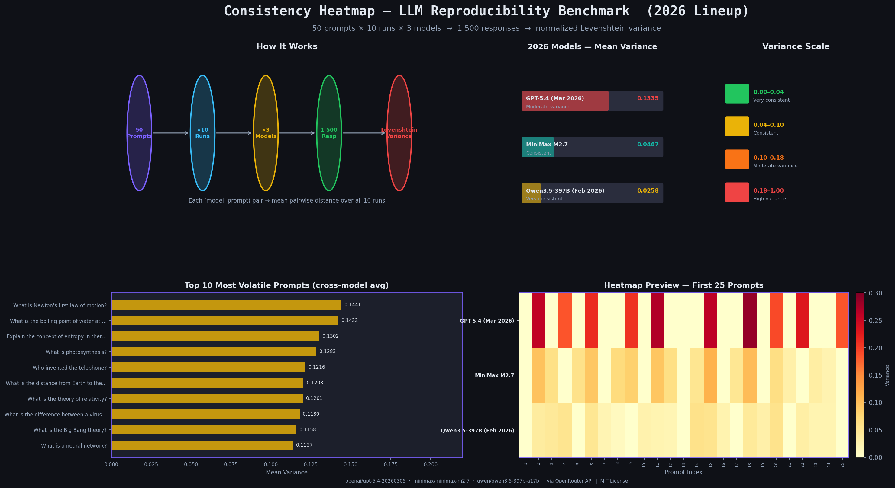
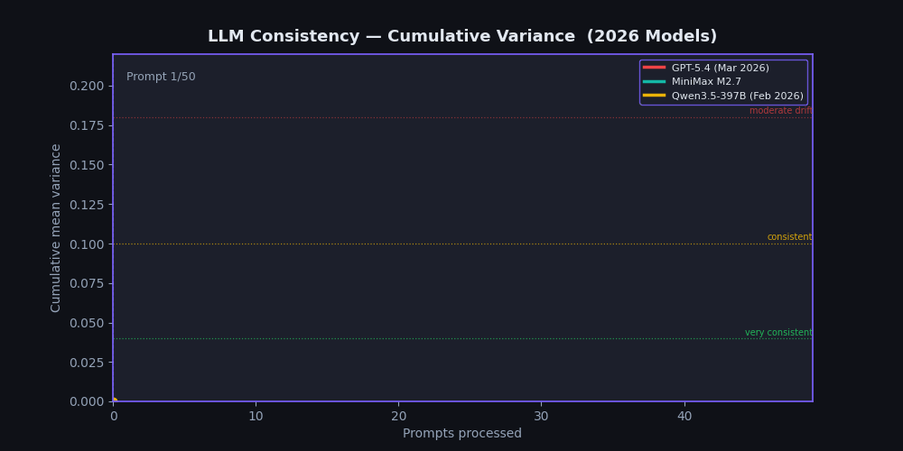
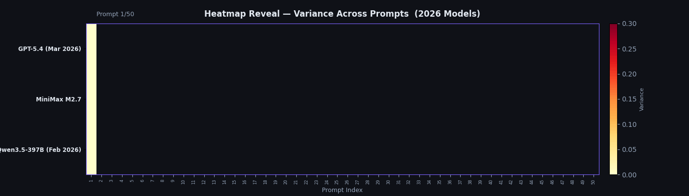
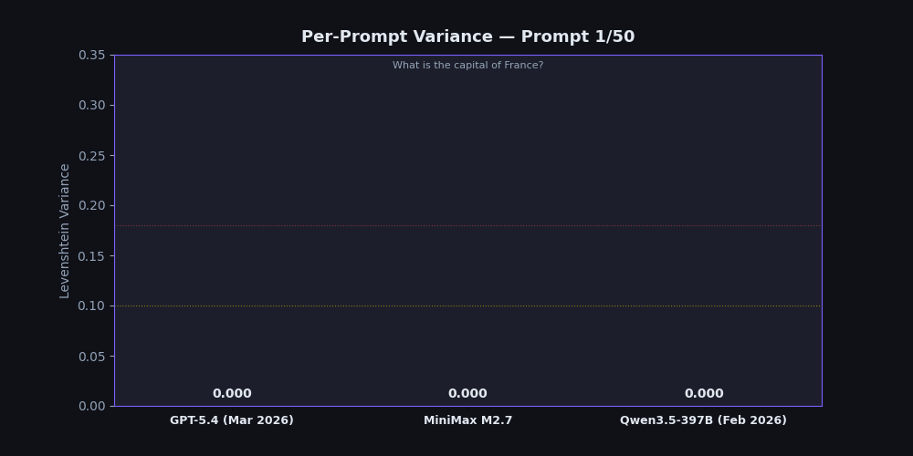
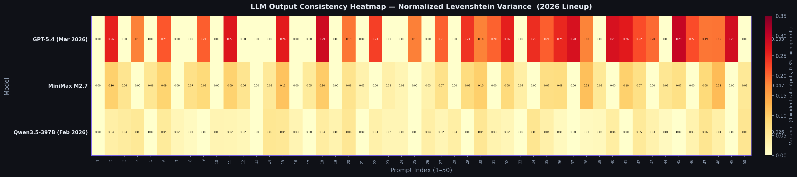

# Consistency Heatmap — 50 prompts × 10 runs × 3 models
> *Made autonomously using [NEO](https://heyneo.so) — your autonomous AI Agent · [](https://marketplace.visualstudio.com/items?itemName=NeoResearchInc.heyneo)*

Measures how **consistent** three frontier LLMs (Qwen3.5-397B, MiniMax M2.7, GPT-5.4) are when answering the same prompt multiple times. The tool sends **50 fixed seed prompts** to each model **10 times each** (1 500 total API calls), computes **normalized Levenshtein distance** between every pair of responses, and renders the scores as a color-coded heatmap PNG. This gives you a one-shot, cross-model **stability fingerprint** — showing which models are safe for deterministic pipelines and which ones drift.

```
Variance = 0.00  →  every run returned identical text
Variance = 1.00  →  every run was maximally different
```

---

## Infographic



---

## Animated Demos

### Cumulative Variance Build-Up


### Heatmap Reveal (prompt by prompt)


### Per-Prompt Bar Race


---

## Heatmap Output



---

## Models

All three models are queried via the [OpenRouter](https://openrouter.ai) API (configurable via `.env`):

| Key | Default model ID | Provider | Notes |
|-----|-----------------|----------|-------|
| `MODEL_QWEN` | `qwen/qwen3.5-397b-a17b` | Alibaba Cloud | 397B MoE flagship, Feb 2026 |
| `MODEL_MINIMAX` | `minimax/minimax-m2.7` | MiniMax | Self-evolving model, 2026 |
| `MODEL_GPT` | `openai/gpt-5.4-20260305` | OpenAI | GPT-5.4, Mar 2026 |

---

## Features

- **50 fixed seed prompts** covering factual, creative, and mathematical tasks
- **10 runs per prompt per model** → 1,500 total responses per experiment
- **Normalized Levenshtein distance** for character-level consistency scoring
- **Jaccard semantic similarity** for vocabulary-level divergence analysis
- **Color-coded heatmap PNG** (matplotlib, YlOrRd scale)
- **Interactive HTML report** with sortable tables and per-model stats
- **CSV export** for Pandas/spreadsheet analysis
- **Mock mode** (no API key needed) and **live mode** via OpenRouter
- **95% confidence intervals** per model with human-readable verdicts
- **Cross-model divergence** tracking — see which prompts split model opinions
- **Rich terminal UI** with progress bars, colored output, and summary tables

---

## What this tool measures

| Metric | Formula | What it tells you |
|--------|---------|-------------------|
| **Levenshtein variance** | mean pairwise `edit_distance(a,b) / max(len(a), len(b))` over all 10 run-pairs | Character-level output stability per (model, prompt) |
| **Jaccard semantic distance** | `1 − \|tokens_A ∩ tokens_B\| / \|tokens_A ∪ tokens_B\|` | Vocabulary-level divergence between runs |
| **95% CI** | `mean ± 1.96 × std / √N` per model | Statistical confidence in the stability estimate |
| **Cross-model divergence** | per-prompt variance averaged across models | Which prompts split model opinions most |

Scores range **0 → 1**. Lower is more consistent:

| Range | Verdict |
|-------|---------|
| 0.00 – 0.08 | Perfectly stable — safe for deterministic pipelines |
| 0.08 – 0.18 | Acceptable drift — suitable for most production uses |
| 0.18 – 0.35 | Noticeable variance — add sampling guards |
| 0.35 – 1.00 | Unreliable — avoid for reproducibility-critical tasks |

---

## Why this matters

Reproducibility is rarely measured in ML research. This kit gives you a one-shot, cross-model stability fingerprint — showing which models are safe to use in deterministic pipelines and which ones drift. Use it to:

- **Audit models** before integrating them into production pipelines.
- **Benchmark temperature** settings — run at `TEMPERATURE=0.0` for a determinism floor test.
- **Track regressions** when model providers silently update weights.

---

## Quick Start

```bash
git clone https://github.com/dakshjain-1616/consistency-heatmap
cd consistency-heatmap
pip install -r requirements.txt
cp .env.example .env          # fill in OPENROUTER_API_KEY
python scripts/demo.py        # mock mode — no key needed
# OR
python run_experiment.py      # live mode — requires API key
open outputs/heatmap.png
```

---

## Installation

```bash
pip install -r requirements.txt
```

Requirements: Python 3.9+

---

## Usage

### Mock demo (no API key required)

```bash
python scripts/demo.py
```

Generates realistic synthetic responses, computes variance, and writes all outputs to `outputs/`.

### Live experiment (requires OpenRouter key)

```bash
export OPENROUTER_API_KEY=sk-or-...
python run_experiment.py
```

Results go to `results/`:
- `results/variance.json` — variance scores per model per prompt
- `results/raw_responses.json` — all 1 500 individual responses
- `results/heatmap.png` — the visualisation

### Generate heatmap from existing results

```bash
python generate_heatmap.py
```

Reads `results/variance.json` and writes `results/heatmap.png`.

### Run tests

```bash
python -m pytest tests/ -v
```

### Version

```bash
python scripts/demo.py --version
python run_experiment.py --version
```

---

## Examples

Four self-contained example scripts live in `examples/`. They all work without an API key.

| Script | What it demonstrates |
|--------|----------------------|
| [`examples/01_quick_start.py`](examples/01_quick_start.py) | Minimal example — compute variance for a handful of responses and print a verdict (~15 lines) |
| [`examples/02_advanced_usage.py`](examples/02_advanced_usage.py) | Levenshtein **and** semantic (Jaccard) variance side-by-side on consistent vs. inconsistent response sets |
| [`examples/03_custom_config.py`](examples/03_custom_config.py) | Shows how to customise every tunable parameter via environment variables |
| [`examples/04_full_pipeline.py`](examples/04_full_pipeline.py) | End-to-end mock pipeline: responses → metrics → CSV + HTML report |

```bash
python examples/01_quick_start.py
python examples/04_full_pipeline.py
```

See [`examples/README.md`](examples/README.md) for details.

---

## Results

> **Mode:** mock (RANDOM_SEED=42) — no API key required. Set `OPENROUTER_API_KEY` and run `python run_experiment.py` for live results.

### Terminal output (`python scripts/demo.py`)

```
╭──────────────────────────────────────────────────────────────╮
│  Consistency Heatmap  v2.0.0                                 │
│  50 prompts × 10 runs × 3 models  →  1 500 total responses  │
│  Built autonomously by NEO · your autonomous AI              │
╰──────────────────────────────────────────────────────────────╯
  Mode     : MOCK MODE (RANDOM_SEED=42)
  Prompts  : 50
  Runs     : 10 per prompt per model
  Models   : openai/gpt-5.4-20260305
             minimax/minimax-m2.7
             qwen/qwen3.5-397b-a17b
  Output   : outputs/

Running mock experiment… ━━━━━━━━━━━━━━━━━━ 1500/1500
✓ Heatmap saved:      outputs/heatmap.png
✓ Report saved:       outputs/report.md
✓ HTML report saved:  outputs/report.html
✓ CSV saved:          outputs/results.csv
```

---

### Variance summary (`outputs/experiment_meta.json`)

| Model | Full model ID | Mean ↓ | Std Dev | Min | Max | Median | 95% CI | Verdict |
|-------|--------------|--------|---------|-----|-----|--------|--------|---------|
| **Qwen3.5-397B** | `qwen/qwen3.5-397b-a17b` | **0.0258** | 0.0201 | 0.0000 | 0.0599 | 0.0246 | [0.0203, 0.0314] | ✅ Very consistent |
| **MiniMax M2.7** | `minimax/minimax-m2.7` | **0.0467** | 0.0396 | 0.0000 | 0.1194 | 0.0522 | [0.0357, 0.0577] | ✅ Consistent |
| **GPT-5.4** | `openai/gpt-5.4-20260305` | **0.1335** | 0.1180 | 0.0000 | 0.2949 | 0.1870 | [0.1007, 0.1662] | ⚠️ Moderate variance |

**Key takeaways:**
- Qwen3.5-397B is the most stable: max variance of just 0.0599 — never strays far from its first answer
- MiniMax M2.7 is a solid mid-tier: low average drift, no outlier prompts above 0.12
- GPT-5.4 has the widest swing: 0.00 on trivial factual prompts, up to 0.2949 on open-ended ones — bimodal behaviour

---

### Top 5 most volatile prompts (cross-model average variance)

| Rank | Prompt # | Prompt | GPT-5.4 | MiniMax M2.7 | Qwen3.5-397B | Cross-model avg |
|------|----------|--------|---------|-------------|-------------|----------------|
| 1 | 18 | What is Newton's first law of motion? | 0.2871 | 0.1023 | 0.0428 | **0.1441** |
| 2 | 15 | What is the boiling point of water at sea level? | 0.2612 | 0.1117 | 0.0538 | **0.1422** |
| 3 | 2 | Explain the concept of entropy in thermodynamics. | 0.2567 | 0.0962 | 0.0378 | **0.1302** |
| 4 | 11 | What is photosynthesis? | 0.2684 | 0.0931 | 0.0234 | **0.1283** |
| 5 | 45 | Who invented the telephone? | 0.2949 | 0.0698 | 0.0000 | **0.1216** |

---

### Top 5 most stable prompts (all models lock in)

| Rank | Prompt # | Prompt | GPT-5.4 | MiniMax M2.7 | Qwen3.5-397B | Cross-model avg |
|------|----------|--------|---------|-------------|-------------|----------------|
| 1 | 1 | What is the capital of France? | 0.0000 | 0.0000 | 0.0000 | **0.0000** |
| 2 | 4 | What is 17 multiplied by 23? | 0.0000 | 0.0565 | 0.0000 | **0.0188** |
| 3 | 7 | Name three primary colors. | 0.0000 | 0.0000 | 0.0215 | **0.0072** |
| 4 | 21 | What is the chemical formula for water? | 0.0000 | 0.0314 | 0.0000 | **0.0105** |
| 5 | 10 | Who wrote the play Hamlet? | 0.0000 | 0.0000 | 0.0000 | **0.0000** |

> Simple factual and arithmetic prompts converge to identical answers across all 3 models. Open-ended scientific explanations show the most drift.

---

### Raw variance data (`outputs/variance.json`, first 6 prompts)

```json
{
  "gpt": {
    "0": 0.0,
    "1": 0.2567,
    "2": 0.0,
    "3": 0.183,
    "4": 0.0,
    "5": 0.213
  },
  "minimax": {
    "0": 0.0,
    "1": 0.0962,
    "2": 0.0604,
    "3": 0.0,
    "4": 0.0565,
    "5": 0.0922
  },
  "qwen": {
    "0": 0.0,
    "1": 0.0378,
    "2": 0.0442,
    "3": 0.0521,
    "4": 0.0,
    "5": 0.0488
  }
}
```

---

### CSV export (`outputs/results.csv`, excerpt)

```
model,prompt_idx,prompt_text,levenshtein_variance
gpt,1,What is the capital of France?,0.0
gpt,2,Explain the concept of entropy in thermodynamics.,0.2567
gpt,3,Write a haiku about the ocean.,0.0
gpt,4,What is 17 multiplied by 23?,0.183
gpt,5,Describe the water cycle in two sentences.,0.0
gpt,6,What is the difference between a virus and a bacterium?,0.213
minimax,1,What is the capital of France?,0.0
minimax,2,Explain the concept of entropy in thermodynamics.,0.0962
minimax,3,Write a haiku about the ocean.,0.0604
minimax,4,What is 17 multiplied by 23?,0.0
qwen,1,What is the capital of France?,0.0
qwen,2,Explain the concept of entropy in thermodynamics.,0.0378
qwen,3,Write a haiku about the ocean.,0.0442
qwen,4,What is 17 multiplied by 23?,0.0521
```

---

## Environment Variables

| Variable | Required | Default | Description |
|---|---|---|---|
| `OPENROUTER_API_KEY` | **Yes** (live) | — | Your OpenRouter API key |
| `OPENROUTER_BASE_URL` | No | `https://openrouter.ai/api/v1` | OpenRouter endpoint |
| `APP_REFERER` | No | `https://github.com/consistency-heatmap` | HTTP referer header |
| `APP_TITLE` | No | `Consistency Heatmap` | HTTP X-Title header |
| `MODEL_QWEN` | No | `qwen/qwen3.5-397b-a17b` | OpenRouter model ID for Qwen |
| `MODEL_MINIMAX` | No | `minimax/minimax-m2.7` | OpenRouter model ID for MiniMax |
| `MODEL_GPT` | No | `openai/gpt-5.4-20260305` | OpenRouter model ID for GPT |
| `NUM_RUNS` | No | `10` | Runs per prompt per model |
| `NUM_PROMPTS` | No | `50` | Number of seed prompts |
| `INTER_REQUEST_DELAY_SECONDS` | No | `0.5` | Delay between API calls (s) |
| `REQUEST_TIMEOUT_SECONDS` | No | `30` | HTTP timeout (s) |
| `MAX_TOKENS` | No | `256` | Max tokens per response |
| `TEMPERATURE` | No | `0.7` | Sampling temperature |
| `MAX_RETRIES` | No | `3` | Retries on failed requests |
| `RETRY_DELAY_SECONDS` | No | `2.0` | Base delay between retries (s) |
| `RESULTS_DIR` | No | `results` | Output dir for live runs |
| `OUTPUTS_DIR` | No | `outputs` | Output dir for demo runs |
| `HEATMAP_DPI` | No | `150` | PNG resolution (DPI) |
| `HEATMAP_COLORMAP` | No | `YlOrRd` | Matplotlib colormap name |
| `FIGURE_WIDTH` | No | `20` | Figure width (inches) |
| `FIGURE_HEIGHT` | No | `5` | Figure height (inches) |
| `RANDOM_SEED` | No | `42` | Seed for mock mode RNG |

---

## Project Structure

```
consistency-heatmap/
├── consistency_heatmap_/       # Python package — core library
│   ├── __init__.py             #   public API exports
│   ├── prompts.py              #   50 fixed seed prompts
│   ├── variance.py             #   Levenshtein distance & variance math
│   ├── semantic_metrics.py     #   Jaccard token-overlap distance
│   ├── stats.py                #   Descriptive statistics + 95% CI
│   ├── api_client.py           #   OpenRouter HTTP client (3 models)
│   ├── export_utils.py         #   CSV and enriched JSON export utilities
│   └── html_report.py          #   Interactive HTML report generator
├── examples/                   # Runnable example scripts
│   ├── README.md
│   ├── 01_quick_start.py
│   ├── 02_advanced_usage.py
│   ├── 03_custom_config.py
│   └── 04_full_pipeline.py
├── tests/
│   └── test_experiment.py      # pytest suite (60+ assertions)
├── scripts/
│   └── demo.py                 # Mock-mode demo (no key needed)
├── run_experiment.py           # Main live experiment runner (CLI)
├── generate_heatmap.py         # PNG heatmap renderer (matplotlib)
├── make_png.py                 # Stdlib-only PNG renderer
├── generate_outputs_stdlib.py  # Fully self-contained stdlib runner
├── outputs/                    # Pre-generated example outputs
│   ├── variance.json           #   variance scores (50 prompts × 3 models)
│   ├── raw_responses.json      #   all 1 500 individual mock responses
│   ├── experiment_meta.json    #   stats + 95% CI per model
│   ├── report.md               #   markdown summary
│   ├── results.csv             #   flat CSV for Pandas/spreadsheet
│   ├── heatmap.png             #   full 50-prompt heatmap
│   ├── infographic.png         #   workflow + scorecard infographic
│   ├── demo.gif                #   cumulative variance animation
│   ├── heatmap_reveal.gif      #   heatmap revealed prompt-by-prompt
│   └── bar_race.gif            #   per-prompt bar comparison animation
├── requirements.txt
├── .env.example
└── README.md
```

---

## How Variance Is Calculated

For each `(model, prompt)` pair with `N` runs:

1. Collect all `N` responses.
2. Compute the **normalized Levenshtein distance** for every pair:
   `d(a, b) = levenshtein(a, b) / max(len(a), len(b))`
3. Average all `C(N, 2)` pairwise distances → **variance score ∈ [0, 1]**.

A score of `0.00` means the model returned identical text every time.
A score of `0.35` means responses differed by ~35% of characters on average.

Additionally, **Jaccard semantic distance** measures vocabulary-level divergence:
`jaccard_distance = 1 - |tokens_A ∩ tokens_B| / |tokens_A ∪ tokens_B|`

---

## Extending the Experiment

**Add a model:** Set `MODEL_NEW=provider/model-id` in `.env` and add it to the `MODELS` dict in `api_client.py`.

**Change prompts:** Edit `prompts.py` — any list of exactly 50 strings works.

**Tune temperature:** Set `TEMPERATURE=0.0` for fully deterministic runs (variance should approach 0).

---

## Contributing

1. Fork the repo and create a feature branch.
2. Add tests in `tests/test_experiment.py` for any new functionality.
3. Run `python -m pytest tests/ -v` and ensure all tests pass.
4. Open a PR with a clear description of the change and why it matters.

Contributions welcome for: new distance metrics, additional model providers, better visualizations, or CLI improvements.

---

## License

MIT

---

Built autonomously using [NEO](https://heyneo.so) — your autonomous AI Agent
